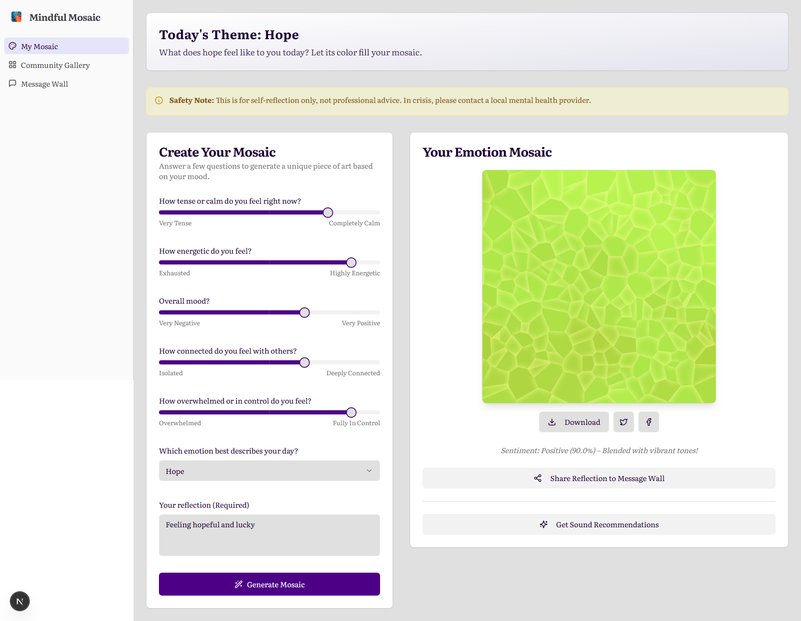
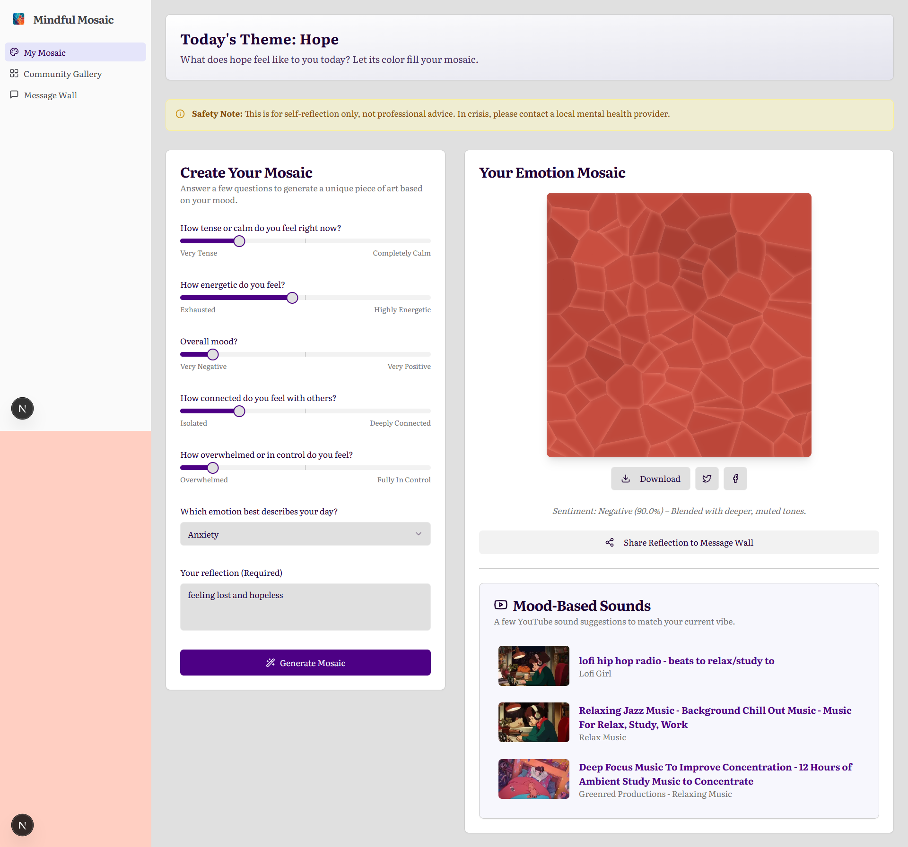
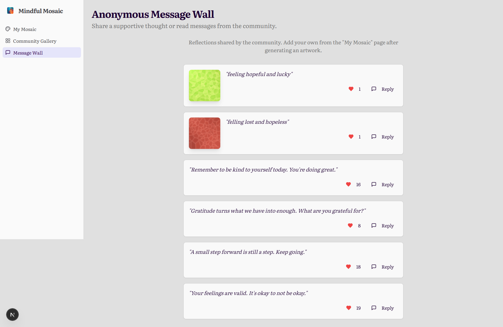
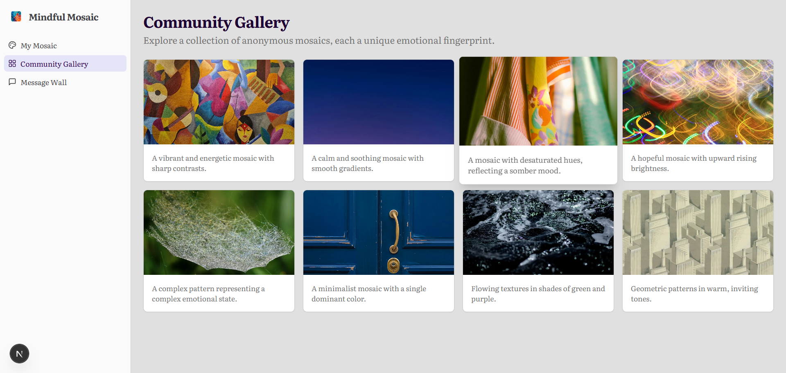

# 🌈 **Mindful Mosaic**: A Digital Journey of Emotion & Art 🎨

**Mindful Mosaic** is a web application that transforms your daily emotions into beautiful, abstract mosaic art while providing mood-based music recommendations from YouTube. By combining principles from psychology and color theory, this tool helps users track their mental well-being through creative visualizations and therapeutic audio suggestions. Whether you are reflecting on a calm day or seeking an emotional uplift, **Mindful Mosaic** weaves your feelings into shareable artwork and curated playlists—promoting self-awareness and emotional resonance in the digital age.

Inspired by frameworks like **PANAS**, **DASS-21**, and the **Circumplex Model of Affect**, this project blends **generative art** (via **p5.js**) with **AI-driven sentiment analysis** (using **Hugging Face**) and **music discovery** (through the **Invidious API**). The application is **privacy-focused**, **client-side heavy**, and **easy to deploy**.

##**Live Demo**
https://vercel.com/saads-projects-8b312ce4/mindful_mosaic

## 📸 **Screenshots**


### 🎨 **Mosaic Generation**



_✨ Witness your emotions transform into unique, vibrant mosaics!_


### 🎶 **Mood-Based Music Recommendations**



_🎧 Discover personalized music to match your mood._


### 📊 **Daily Mood Entry**



_📝 Easily log your daily emotions with our intuitive form._


### 🚀 **Insights & Export**



_📈 Gain insights into your emotional trends and export your art._

## ✨ **Features**

### 🎨 **Emotion-Driven Mosaic Generation**
- **Daily Mood Entry**: Answer a quick 6-question form based on validated scales (e.g., PANAS and DASS-21).
- **Generative Art**: Create static, abstract mosaics using **Voronoi tessellation**, **Perlin noise**, and **chroma.js** for color harmony.
- **Custom Visual Mappings**: 
  - **Hue** for mood (warm for positive, cool for negative).
  - **Saturation** for energy level.
  - **Texture** for stress, creating a unique, gallery-worthy mosaic every time.

### 🤖 **AI-Powered Sentiment Analysis**
- **Text Reflection**: Optional text input analyzed by **Hugging Face**’s Inference API (free tier) for positive/negative/neutral sentiment detection.
- **Dynamic Palette Adjustments**: Automatically adjusts the color palette based on your sentiment, e.g., activating **warmer tones** for positive moods or **cooler hues** for negative ones.

### 🎶 **Mood-Based Music Recommendations**
- **YouTube Integration**: Uses the **Invidious API** (free, no API key required) to fetch music suggestions based on your current mood.
- **Curated Playlists**: Provides 3 mood-matched songs with thumbnails, titles, and direct YouTube links—no need for signups.

### 🔒 **Privacy & Accessibility**
- **Privacy-Focused**: All mood logs are stored locally in **LocalStorage**. Optional anonymous sharing is available.
- **Inclusive Design**: Responsive layout, dark mode toggle, and ARIA labels for accessibility.
- **Safety Resources**: Includes crisis resources (e.g., **988 Lifeline**) for mental health support.

### 📥 **Export & Share**
- **Download High-Res Art**: Save your mosaic as a **PNG** file.
- **Embeddable Music Player**: Easily share your music recommendations via an embeddable player.

---

## 🧠 **How It Works**

### **The Daily Flow**

1. **Mood Entry**: Complete a quick 6-question form (sliders + dropdown).
2. **Sentiment Boost**: Optional text reflection analyzed by the **Hugging Face API**.
3. **Art Weaving**: **p5.js** generates a static mosaic based on your mood (e.g., smooth blues for calm, clustered tiles for connection).
4. **Music Harmony**: **Invidious API** fetches 3 YouTube songs that match your mood (e.g., lo-fi for neutral).
5. **Reflect & Export**: View insights, download your art, and listen to personalized recommendations.

---

### **Mood Mapping & Visual Representation**
-----------------------------------------------------------------------------------------
| **Dimension**    | **Visual Mapping**                     | **Technology**            |
|------------------|----------------------------------------|---------------------------|
| **Calmness**     | Smooth gradients (low noise)           | **Perlin noise** in p5.js |
| **Energy**       | Inner glow intensity                   | **Canvas shadows**        |
| **Positivity**   | Warm hue shift                         | **chroma.js palettes**    |
| **Sentiment**    | Palette override (e.g., Joy for positive) | **Hugging Face API**   |
-----------------------------------------------------------------------------------------

**Example Insight**:  
*“Your stress decreased by 12% this week—your mosaic flows more harmoniously! 🕊️”*

---

## 🛠️ **Tech Stack**

| **Layer**        | **Technology**                       | **Purpose**                               |
|------------------|--------------------------------------|-------------------------------------------|
| **Frontend**     | HTML5, CSS3, p5.js, chroma.js, d3-delaunay | Mosaic generation, user interface   |
| **AI/ML**        | Hugging Face Inference API (free)    | Sentiment analysis                        |
| **Music**        | Invidious API (free YouTube proxy)   | Song search & recommendations             |
| **Storage**      | LocalStorage / IndexedDB             | Privacy-first mood logs                   |
| **Analytics**    | Chart.js (optional)                  | Weekly insights                           |
| **Deployment**   | GitHub Pages / Vercel / Netlify      | Static hosting, easy deploy               |

No backend required—fully **client-side** for privacy and speed.

---

## 🚀 **Quick Start**

### **Prerequisites**
- Modern web browser (**Chrome/Firefox** recommended).
- **Free Hugging Face** account (optional; fallback works without token).

### **Setup & Run Locally**

1. **Clone the Repo**:
   ```bash
   git clone https://github.com/shafayatsaad/mindful_mosaic.git
   cd mindful_mosaic
   ```

2. **Install Dependencies** (optional; libraries are CDN-loaded):
   ```bash
   npm init -y  # Optional, as libraries are loaded via CDN
   ```

3. **Add Your Hugging Face API Token**:
   - Replace `'hf_YourTokenHere'` with your API token in `index.html` from [huggingface.co/settings/tokens](https://huggingface.co/settings/tokens).

4. **Run Locally**:
   - Open `index.html` in a browser (use **Live Server** extension in VS Code for best experience).
   - Fill the form → Generate your first mosaic!

### **Deployment**

- **GitHub Pages**: Push to the `main` branch → **Settings** > **Pages** > **Deploy from branch**.
- **Vercel/Netlify**: Connect GitHub repo → Auto-deploys on push.
- **Custom Domain**: Easy via platform settings.

[Live Demo](https://vercel.com/saads-projects-8b312ce4/mindful_mosaic)

---

## 📋 **Usage**

1. Navigate to the mood entry form.
2. Adjust the sliders and dropdowns to reflect your mood.
3. Optionally, add a text reflection (e.g., "Feeling grateful today").
4. Hit **Generate** to see your mosaic + song recommendations.
5. Download/share your artwork.

**Pro Tip**: Log your mood daily for weekly insights—track your emotional trends visually!

---

## 🤝 **Contributing**

We welcome contributions to **Mindful Mosaic**! Here’s how you can help:

1. **Fork** the repository.
2. **Create a new branch** (`git checkout -b feature/awesome-feature`).
3. **Commit changes** (`git commit -m 'Add amazing feature'`).
4. **Push** the branch (`git push origin feature/awesome-feature`).
5. **Open a pull request**.

### **Contribution Guidelines**
- Follow **semantic versioning**.
- Add **tests** for new features.
- Update the **README** with any changes.

---

## 📄 **License**

This project is licensed under the **MIT License** - see the [LICENSE](LICENSE) file for details.

---

## 🙏 **Acknowledgments**

- **p5.js & chroma.js**: For generative art and color harmonies.
- **Hugging Face**: Providing AI-powered sentiment analysis.
- **Invidious**: Open-source YouTube proxy for free music access.
- **Research Inspiration**: Color psychology studies (e.g., Elliot & Maier, 2012) and wellness apps like **Daylio**.

---

Star this repo if it helped you reflect or create!


---

## 📞 **Contact**

- **Author**: Shafayat Saad  
- **Report Issues**: [GitHub Issues](https://github.com/shafayatsaad/mindful_mosaic/issues)  
- **Feedback**: Open a discussion or email [dev.saad30@gmail.com](mailto:dev.saad30@gmail.com)

---
